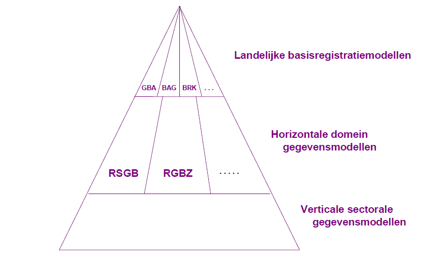
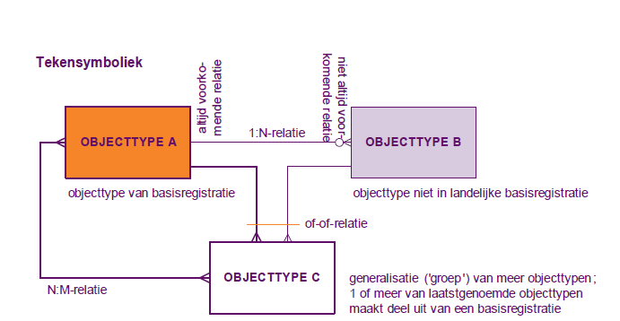
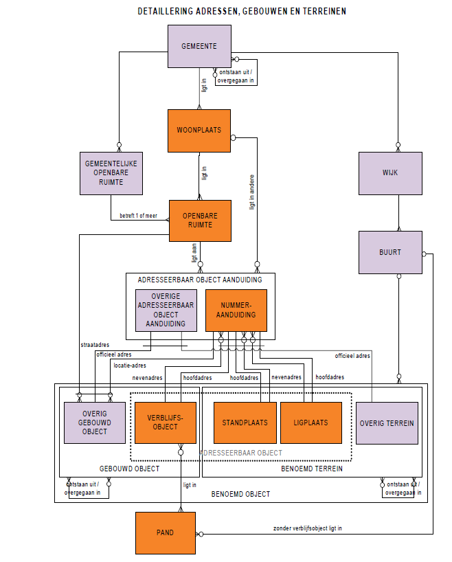

# Referentiemodel Stelsel van Gemeentelijke Basisgegevens (RSGB)

Versie 2.02 — Deel I: Beschrijving  
Onderdeel van de GEMeentelijke Model Architectuur (GEMMA)

# Voorwoord

Burgers en bedrijven hoeven (straks) nog maar één keer hun gegevens aan de overheid te verstrekken. Landelijke basisregistraties zorgen voor het meervoudig gebruik hiervan binnen de overheid. Vóór die tijd dienen gemeenten minimaal hun basisgegevens op orde te hebben. Vanwege het belang van een goede gegevenshuishouding heeft KING medio 2007 versie 1.0 uitgebracht van het Referentiemodel Stelsel van Gemeentelijke Basisgegevens (RSGB). Daarmee speelden wij in op de overheidsbrede invoering van het landelijk stelsel van basisregistraties. Tevens verving dit het GFO Basisgegevens. In het voorjaar van 2008 hebben we met versie 1.1. het toepassingsgebied van het RSGB vergroot met de Basisregistratie WOZ (Waardering Onroerende Zaken). Voortschrijdend inzicht, de eerste ervaringen met het RSGB, ontwikkelingen in de (catalogi van de) landelijke basisregistraties en het ontwikkelen van de berichtenstandaard StUF-BG hebben ons aanleiding gegeven versie 2.0 van het RSGB uit te brengen. Dit objecten- of gegevensmodel ondersteunt gemeenten bij het stroomlijnen van hun gegevenshuishouding en de daarop gerichte processen voor beheer en gebruik. Ook voorziet het in standaarden voor gegevensuitwisseling, zodat gemeenten een samenhangende informatievoorziening kunnen opzetten. In versie 2.02 zijn wijzigingen doorgevoerd naar aanleiding van de aanpassingen die zijn doorgevoerd in de catalogus BAG (versie 2009) en het Logisch Ontwerp GBA (versie LO3.7). Deze wijzigingen zijn te vinden in een separaat document.
Beheer
De rapportage RSGB 2.0 is in mei 2009 vastgesteld door de StUF-regiegroep. Versie 2.02 betreft een patch m.b.t. Een aanpassing van niet-natuurlijke personen op verzoek van de StUF expertgroep.
Het beheer van het RSGB is per 1 januari 2010 overgenomen door KING, het KwaliteitsInstituut Nederlandse Gemeenten. Voor vragen, suggesties of opmerkingen kunt u contact opnemen met ons.
Commentaar op deze versie nemen we in de normale beheerprocedure van het RSGB mee. KING-specialisten beoordelen wijzigingsverzoeken en leggen ze ter advisering voor aan werkgroepen met een publiek-private samenstelling. Iedere belangstellende kan wijzigingsverzoeken indienen.

# Leeswijzer
 
De rapportage richt zich op iedereen die zich beroepsmatig bezighoudt met (het structureren van) de gemeentelijke informatievoorziening, het inrichten en beheren van basisregistraties en/of het tot stand brengen en beheren van gegevensuitwisseling.
De rapportage is opgebouwd overeenkomstig de gebruikelijke indeling van catalogi voor basisregistraties. Vanwege de omvang is zij in twee delen opgesplitst. Deel I beschrijft het RSGB op hoofdlijnen en licht het referentiemodel nader toe. In hoofdstuk 2 van deel I vindt u een overzicht van het objectenmodel en de daarmee samenhangende aspecten. In bijlage 1 lichten wij de wijzigingen toe ten opzichte van versie 1.1. In bijlage 2 geven we aan welke uit het GFO-BG afkomstige gegevens op welke wijze in het RSGB zijn opgenomen.
In Deel II vindt u de specificaties van de componenten waaruit het RSGB is opgebouwd: objecttypen (hoofdstuk 1), attribuutsoorten en relatiesoorten (hoofdstuk 2). Dit deel is vooral als ‘naslagwerk’ bedoeld.

---

# Samenvatting
De invoering van een overheidsbreed stelsel van basisregistraties is één van de meest ingrijpende ontwikkelingen waarmee gemeenten te maken hebben. Het Referentiemodel Stelsel van Gemeentelijke Basisgegevens (RSGB) biedt gemeenten en hun leveranciers houvast bij het invoeren en het gebruiken van deze gegevens.
Dit objectenmodel voor de gemeentelijke basisgegevens presenteert de samenhang tussen basisregistraties op een logische wijze. Maar gemeenten hebben meer gegevens nodig voor hun werkprocessen dan nu in de landelijke basisregistraties beschikbaar zijn. Het binnengemeentelijk stelsel is dan ook ‘rijker’ dan het landelijke stelsel.
Dit referentiemodel is onderdeel van de GEMmeentelijke Model Architectuur (GEMMA) van KING. De inhoud is in lijn met de Nederlandse OverheidsReferentieArchitectuur (NORA).

## Inhoud

We hebben het RSGB gebaseerd op de Basisregistraties Adressen (BRA), Gebouwen (BGR), Personen (GBA), Bedrijven (NHR), Kadaster (BRK) en WOZ (BRWOZ) en op de grootschalige topografie die in het Informatiemodel Geografie (IMGeo) is gedefinieerd. We hebben dit aangevuld met gegevens van de voorloper van het referentiemodel, het GFO BasisGegevens uit 1998, waarbij het model bewust beperkt gehouden is.
Het referentiemodel is opgebouwd uit:
- objecttypen zoals ‘Verblijfsobject’ en ‘Ingeschreven persoon’;
- attribuutsoorten die eigenschappen van deze objecttypen beschrijven zoals ‘Bruto inhoud’ en ‘Voornamen’;
- relatiesoorten tussen deze objecttypen zoals ‘Ingeschreven persoon verblijft in Verblijfsobject’.

## Doelen

Het referentiemodel draagt er aan bij dat gemeenten en daarmee samenwerkende organisaties in staat zijn om de kern van hun gegevenshuishouding, de basisgegevens, in samenhang eenmalig te onderhouden en meervoudig te gebruiken bij de uitoefening van hun taken. Het stroomlijnen van de processen voor het beheer van deze gegevens biedt kansen voor efficiencyverbetering. Meervoudig gebruik van gegevens, waarbij vertrouwd kan worden op de kwaliteit van deze gegevens, is bijvoorbeeld van groot belang voor een goede dienstverlening. Verder vormt het referentiemodel de grondslag voor de berichtenstandaard StUF-B(asis)G(egevens). Leveranciers baseren hun software op deze standaard, zodat uitwisselbaarheid van basisgegevens wordt bereikt. Tot slot waarborgt het referentiemodel de uitwisseling van basisgegevens met het landelijk stelsel van basisregistraties en het benutten van dit stelsel in de gemeentelijke informatievoorziening.

## Invoering

Het is de bedoeling om het referentiemodel in de periode 2009 – 2010 geleidelijk in te voeren. KING verwacht dat leveranciers in die tijd hun software aanpassen aan de basisregistraties. Gedurende de genoemde periode zullen de versies van de berichtenstandaard StUF-BG op basis van het GFO-Basisgegevens en op basis van het RSGB naast elkaar bestaan, zodat een geleidelijke overgang mogelijk is. KING raadt gemeenten nadrukkelijk aan om de ontwikkeling van hun informatievoorziening te baseren op dit referentiemodel en niet alleen uit te gaan van één of meer (catalogi van) landelijke basisregistraties. Op deze manier kunnen gemeenten aansluiten bij het landelijk stelsel én wordt hun eigen informatievoorziening optimaal bediend. Het RSGB vult namelijk de gegevens uit het landelijke stelsel aan met gegevens die voor de gemeentelijke processen cruciaal zijn, maar niet in het landelijk stelsel worden geregistreerd.

---

# 1. Inleiding

## 1.1 Aanleiding
De invoering van een stelsel van basisregistraties bij de gehele overheid is zonder twijfel een van de meest ingrijpende ontwikkelingen waar gemeenten mee te maken hebben. Onder het motto ‘De overheid vraagt niet naar de bekende weg’, is wettelijk vastgelegd dat burgers en bedrijven basisgegevens nog maar éénmaal aan de overheid hoeven te verstrekken. Alle overheidsorganisaties zijn verplicht deze gegevens te gebruiken.
Voor gemeenten zijn de basisregistraties dáárom zo belangrijk, omdat zij niet alleen gebruiker ervan zijn, maar ook bronhouder van bijvoorbeeld de basisregistraties van Personen, Adressen en Gebouwen. De basisgegevens vormen nog maar het topje van de ijsberg van wat gemeenten aan gegevens nodig hebben om hun processen uit te voeren.
Om grip te krijgen op de meervoudig gebruikte gegevens, heeft een aantal Voorhoedgemeenten onder leiding van EGEM medio 2007 versie 1.0 uitgebracht van het Referentiemodel Stelsel van Gemeentelijke Basisgegevens (RSGB). Dit model was de opvolger van het ‘oude’ GFO-Basisgegevens van de Vereniging Nederlandse Gemeenten (VNG). In het voorjaar van 2008 hebben we met versie 1.1. het toepassingsgebied van het RSGB vergroot met de Basisregistratie WOZ (Waardering Onroerende Zaken). Daarmee speelden wij in op de overheidsbrede invoering van het landelijk stelsel van basisregistraties. Voortschrijdend inzicht, de eerste ervaringen met het RSGB, ontwikkelingen in de (catalogi van de) landelijke basisregistraties en het ontwikkelen van de berichtenstandaard StUF-BG hebben ons aanleiding gegeven versie 2.0 van het RSGB uit te brengen.

## 1.2 Opzet
KING presenteert met dit stelsel een standaard om het gebruik van basisgegevens binnen gemeenten en daarmee samenwerkende organisaties te bevorderen. We spreken binnen gemeenten over één samenhangend stelsel van basisgegevens en niet over een basisregistratie. Deze laatste term is gereserveerd voor de landelijke basisregistraties. Dit landelijke stelsel vormt echter wel het uitgangspunt voor het gemeentelijke model. Versie 2.0 van het RSGB is gebaseerd op de volgende, al dan niet definitieve, versies van de catalogi en vergelijkbare beschrijvingen van basisregistraties:
- Catalogus BasisRegistratie Adressen (BRA versie 4.0; Vrom, 2-2006),
- Catalogus Basis Gebouwen Registratie (BGR versie 4.0; Vrom, 2-2006),
- Logisch Ontwerp GBA versie 3.6 (11-2007) en concept-versie 3.7 v.w.b. de relatie GBA – BAG,
- Programma van eisen Handelsregister (HR; EZ, 6-2008 versie. 1.6) en de Gegevenscatalogus Nieuw HandelsRegister (concept; VVKvK, 7-2008),
- Catalogus BasisRegistratie Kadaster (BRK; Kadaster, 3-2009 versie. 1.0.4),
- Catalogus Basisregistratie WOZ (BRWOZ; Waarderingskamer, 4-2008, versie 1.3)
en in aanvulling hierop het
- GFO Basisgegevens (VNG, 1998).
De basisregistratie Topografie is niet in het referentiemodel opgenomen. We zijn uitgegaan van grootschalige geo-objecten, met andere woorden de toekomstige Basisregistratie Grootschalige Topografie. Daarvoor gebruikten we het document:
- Informatiemodel Geografie (concept IMGeo; Geonovum v/h Ravi, 3-2007 vs. 2.0).
Het model richt zich vooral op basisregistraties uit de eerste tranche van de inrichting van het stelsel. Pas wanneer er voldoende bekend is over een andere basisregistratie (tweede tranche en verder) wordt het model uitgebreid en aangepast.
Het Referentiemodel Stelsel van Gemeentelijke Basisgegevens is onderdeel van de GEMmeentelijke Model Architectuur (GEMMA) van KING. De inhoud is in lijn met de Nederlandse OverheidsReferentieArchitectuur (NORA).

## 1.3 Invoering
Toepassing van het referentiemodel heeft consequenties voor de gemeentelijke organisatie, haar processen, informatievoorziening, gegevenshuishouding en automatisering. Elke gemeente is autonoom in haar keuzes daarin en KING faciliteert de toepassing waar mogelijk. Het tempo van de invoering is vooral afhankelijk van het verwerken van het referentiemodel in de software die gemeenten gebruiken bij de uitvoering van hun taken.
De software die gemeenten op dit moment gebruiken is vaak (mede) gebaseerd op het eerder genoemde GFO-Basisgegevens. In de jaren 2009 – 2010 passen leveranciers naar verwachting hun software aan op de in te voeren basisregistraties. Dit betekent (ook) een overgang van het GFO-BG naar dit referentiemodel. Om die te ondersteunen, brengt KING tegelijkertijd met het RSGB 2.0 een nieuwe versie van de berichtenstandaard StUF-BG uit. Tijdens deze periode – en mogelijkerwijs langer – bestaat er een StUF-BG-versie op basis van het GFO-Basisgegevens (2.04) en een versie op basis van dit referentiemodel (3.10), waardoor een geleidelijke overgang mogelijk is. KING adviseert gemeenten om bij verdere ontwikkeling van hun informatievoorziening te anticiperen op deze overgang. Ze kunnen dan maatregelen treffen om er voor te zorgen dat in de overgangsperiode hun informatievoorziening overweg kan met beide versies van StUF.

**Méér dan de landelijke basisregistraties**
Het referentiemodel is een vertaling en een uitbreiding van het landelijk stelsel van basisregistraties met het oog op de gemeentelijke informatiebehoefte. Op onderdelen verschilt het dan ook van het landelijk stelsel. Wel zijn de landelijke basisregistraties bijna volledig opgenomen in het referentiemodel. KING raadt gemeenten dringend aan om bij de ontwikkeling van hun informatievoorziening uit te gaan van het referentiemodel en niet alleen van één, of meer, catalogi van landelijke basisregistraties. Op die manier sluiten zij aan bij het landelijk stelsel én kunnen zij hun eigen informatievoorziening optimaal faciliteren. Daarnaast gaat KING er van uit dat de leveranciers van gemeentelijke software niet alleen anticiperen op de landelijke basisregistraties maar ook het referentiemodel en de daarop gebaseerde versie van StUF-BG in de software verwerken.

---

# 2. Objectenmodel

In dit hoofdstuk bakenen we allereerst het stelsel van gemeentelijke basisgegevens af (paragraaf 2.1). We lichten het referentiemodel toe op basis van de objecttypen en hun relaties (paragraaf 2.3). We besteden ook bijzondere aandacht aan de doelen van dit stelsel (paragraaf 2.2) en aan de metagegevens (paragraaf 2.4). Het stelsel schetsen we in de nevenstaande figuur.

## 2.1 Afbakening

Het stelsel van gemeentelijke basisgegevens is geen basisregistratie zoals bedoeld in het (landelijke) stelsel van basisregistraties. Het is de vertaling van dit stelsel naar de gemeentelijke informatievoorziening. Hierin is nadrukkelijk behoefte aan samenhang tussen de objecten en gegevens uit die basisregistraties èn behoefte aan specifieke gemeentelijke basisgegevens. Het RSGB is dan ook meer dan de optelsom van de landelijke basisregistraties. Dit is hieronder gevisualiseerd. Ook ondersteunt de gemeentelijke informatievoorziening diverse taakgebieden en bestaan er uiteenlopende informatiebehoeften. Voor sommige taakgebieden is, of wordt dit uitgewerkt in specifieke informatiemodellen. Deze zijn gerelateerd aan het stelsel van gemeentelijke basisgegevens doordat zij, waar dat zinvol is, een deel van deze objecten en gegevens bevatten.
Het kan voorkomen dat dergelijke taakspecifieke modellen ook zijn gebaseerd op gegevensuitwisseling met niet-gemeentelijke ketenpartners, die op hun beurt weer andere sectormodellen toepassen. De specificaties daarin zouden kunnen afwijken van die in dit referentiemodel. Om dat te voorkomen, lijkt het wenselijk om objecten en gegevens waarvoor dit geldt en die uitgewisseld worden tussen sectoren, op te nemen (en te specificeren) in het landelijk stelsel van basisregistraties. Door deze (gewijzigde) specificaties over te nemen in het referentiemodel ontstaat er weer harmonie tussen de informatiemodellen op de diverse niveaus en binnen de verschillende sectoren.

## 2.2 Doelen
De gemeentelijke gegevenshuishouding omvat een diversiteit aan objecten, gegevens daarvan en relaties daartussen. In de praktijk mondt dit uit in een groot aantal eilanden met eigen specificaties die uitwisseling, koppeling, meervoudig en ‘gemeentebreed’ gebruik van gegevens belemmeren. Eenduidigheid is daarom dringend gewenst. De kern hiervan zijn de gemeentelijke basisgegevens. Dit referentiemodel specificeert het objecten- of gegevensmodel van deze basisgegevens. Dat is in 1998 gebeurd in het GFO-Basisgegevens. Het RSGB kunt u beschouwen als een herziening daarvan op basis van hedendaagse inzichten, met name de komst van het landelijk stelsel van basisregistraties.
Het RSGB wil eraan bijdragen dat gemeenten en daarmee samenwerkende organisaties de kern van hun gegevenshuishouding, de basisgegevens, eenmalig onderhouden en meervoudig gebruiken. De achterliggende doelen zijn:
- het eenduidig onderhouden van basisgegevens door gemeenten;
- uitwisseling van basisgegevens mogelijk te maken, door leveranciers hun software daarop te laten baseren; en
- het waarborgen van het uitwisselen met, en het benutten van, het landelijk stelsel van basisregistraties.

**Houvast**
Dit gegevensmodel vormt geen grondslag voor een (relationele) database. Het staat partijen – gemeenten, leveranciers – vrij om een eigen technische realisatievorm te kiezen. Die kan bijvoorbeeld bestaan uit meerdere databases. De essentie van het referentiemodel is vooral om eenduidig aan te geven welke gegevens kunnen worden ontleend aan het Stelsel van Gemeentelijke Basisgegevens: welke informatievragen kunt u stellen die ook kunnen worden beantwoord? Denk bijvoorbeeld aan ruimtelijke relaties tussen objecten. Uit het model kunt u afleiden over welke ruimtelijke relaties u informatie kunt krijgen, ongeacht of deze relaties administratief zijn vastgelegd, of gegenereerd worden met behulp van GIS-analysetechnieken.
Veel informatievragen zullen voortkomen uit softwarecomponenten die bepaalde taken van de gemeente ondersteunen, en aan softwarecomponenten die delen van het stelsel ondersteunen. Om deze componenten te kunnen laten samenwerken, hebben we het referentiemodel uitgewerkt in een nieuwe versie van de berichtenstandaard StUF-BG, waarin we services of berichten definiëren.
Ten slotte biedt het referentiemodel gemeenten houvast als zij zelf databases en software willen ontwikkelen en helpt het hen bij het selecteren van softwarecomponenten en databases van leveranciers. Het is raadzaam om aan – potentiële – leveranciers steeds te vragen of zij hun database baseren op het referentiemodel en of zij de berichten ondersteunen die op basis van het referentiemodel zijn gespecificeerd.

## 2.3 Toelichting
In deze paragraaf lichten we het objectenmodel toe. Het model op hoofdlijnen is weergegeven in de samenvatting. Het is gebaseerd op de modellen van de diverse basisregistraties. We wijken niet af van deze modellen, maar in sommige gevallen zijn we gedetailleerder of hebben 10
we bepaalde gegevens niet overgenomen. Verder hebben we de modellen aangevuld en met elkaar verbonden, om te kunnen voldoen aan de gemeentelijke behoefte aan basisgegevens. We modelleren alleen de actuele situatie. De behoefte aan historie specificeren we met de desbetreffende metagegevens.

**Tekenwijze**
We brengen een objecttype in beeld met een rechthoek. De naam van het objecttype is in de rechthoek vermeld. In een oranje vlak staan de objecttypen die deel uitmaken van enige (catalogus van een) basisregistratie (A). KING heeft de andere objecttypen toegevoegd. Een witte rechthoek visualiseert een objecttype dat uit meerdere andere objecttypen is samengesteld. Dit is een zogenaamde generalisatie van objecttypen. Laatstgenoemde objecttypen zijn op hun beurt specialisaties van het gegeneraliseerde objecttype. Een gegeneraliseerd objecttype heeft een ‘vet’ kader (C) als één of meer van de specialisaties daarvan deel uitmaken van enige (catalogus van een) basisregistratie. In een blauw vlak staan de objecttypen die geen generalisaties zijn van andere objecttypen en geen deel uitmaken van enige (catalogus van een) basisregistratie (B).

Tussen de objecttypen brengen we de drie soorten relaties als volgt in beeld: een 1:1-relatie (een lijn), een 1:N-relatie (een lijn met één ‘harkje’) en een N:M-relatie (een lijn met twee ‘harkjes’). Een relatie die deel uitmaakt van enige (catalogus van een) basisregistratie is ‘vetter’ gevisualiseerd dan relaties waarvoor dit niet geldt: de relaties die KING heeft toegevoegd. Een relatie veronderstelt dat een object van het ene objecttype altijd gerelateerd is aan dat van het andere objecttype. Wanneer dit niet het geval hoeft te zijn, dan ziet u dat aan het open rondje aan het uiteinde van de relatie(lijn). In het voorbeeld: een object van objecttype B is altijd gerelateerd aan een object van objecttype A, maar andersom hoeft dat niet het geval te zijn. Met een of-of-relatie tenslotte bedoelen we dat een object van – in dit geval – objecttype C een relatie kent met een object van één van beide gerelateerde objecttypen, hier objecttype A of B.

**Basisregistratie-objecten**
De volgende objectenmodellen vormen de kern van het objectenmodel: de Basisregistraties van Adressen en Gebouwen (de BAG: BRA en BGR), de Basisregistratie Personen (GBA en RNI), de Basisregistratie Ondernemingen en Rechtspersonen (het NHR oftewel Nieuw Handelsregister), de Basisregistratie Kadaster (de BRK), de BasisRegistratie WOZ (de BRWOZ) en de Basisregistratie Grootschalige Topografie (GBKN) cq. het Informatiemodel Geografie (IMGeo).
Het gaat om de objecttypen: WOONPLAATS, OPENBARE RUIMTE, NUMMERAANDUIDING (onderdeel van ADRESEERBAAR OBJECT AANDUIDING), VERBLIJFSOBJECT (onderdeel van GEBOUWD OBJECT), STANDPLAATS, LIGPLAATS (beide onderdeel van BENOEMD TERREIN), PAND, INGEZETENE (PERSOON in BRP-termen, hier onderdeel van NATUURLIJK PERSOON), INGESCHREVEN NIET-NATUURLIJK PERSOON (onderdeel van 11
OBJECTTYPE BOBJECTTYPE A1:N-relatieniet altijd voor-komende relatieTekensymboliekobjecttype van basisregistratieobjecttype niet in landelijke basisregistratiealtijd voorko-mende relatieOBJECTTYPE Cgeneralisatie ('groep') van meer objecttypen;1 of meer van laatstgenoemde objecttypen maakt deel uit van een basisregistratieof-of-relatieN:M-relatie
NIET-NATUURLIJK PERSOON), MAATSCHAPPELIJKE ACTIVITEIT, VESTIGING, KADASTRALE ONROERENDE ZAAK, ZAKELIJK RECHT, WOZ-OBJECT, WOZ-BELANG, WOZ-WAARDE en de geo-objecttypen: WEGDEEL, WATERDEEL, TERREINDEEL, SPOORBAANDEEL, KUNSTWERKDEEL en INRICHTINGSELEMENT.

**Adressen, gebouwen en terreinen**
KING heeft de GEMEENTE als objecttype toegevoegd, omdat zij het bestuurlijke gebied is waarbinnen de betreffende ruimtelijke objecten liggen.
Binnen een gemeente bevinden zich één of meer WOONPLAATSen, maar een woonplaats bevindt zich altijd binnen één gemeente.
Binnen elke woonplaats bevinden zich één of meer OPENBARE RUIMTEn die in de BAG zijn gedefinieerd. Aangezien een openbare ruimte, zoals een straat, zich kan uitstrekken over meerdere woonplaatsen is GEMEENTELIJKE OPENBARE RUIMTE toegevoegd. De OPENBARE RUIMTE is nu dát deel van de gemeentelijke openbare ruimte dat zich binnen één woonplaats bevindt.
De CBS-indeling in WIJKen en BUURTen hebben we eveneens toegevoegd. De geometrie is één van de te registreren gegevens. Een belangrijk voordeel hiervan is dat managementinformatie geografisch in beeld gebracht kan worden.
Aan een OPENBARE RUIMTE kunnen ADRESSEERBARE OBJECT AANDUIDINGen gerelateerd zijn. In de meeste gevallen gaat het om NUMMERAANDUIDINGen die de BAG onderscheidt. Soms is het noodzakelijk om ook andere adressen vast te stellen, bijvoorbeeld van terreinen die geen stand- en ligplaatsen zijn en eventueel van gebouwen die geen
verblijfsobjecten zijn. Een dergelijke OVERIGE ADRESSEERBAAR OBJECT AANDUIDING wordt weliswaar officieel vastgesteld, maar maakt geen deel uit van de BAG.
De BGR onderscheidt gebouwde objecten als VERBLIJFSOBJECTen en terreinen als STAND- en LIGPLAATSen. In het RSGB hebben we voor het onderscheid in gebouwen (GEBOUWD OBJECT) en terreinen (BENOEMD TERREIN) gekozen. Met de verblijfsobjecten wordt immers niet de hele gebouwde omgeving, voor zover zinvol, gemodelleerd. Vandaar dat we het OVERIG GEBOUWD OBJECT hebben toegevoegd. Dit geeft, in combinatie met de verblijfsobjecten, gemeenten de mogelijkheid om het deel van de gebouwde omgeving dat zij relevant vinden adequaat te registreren. Een OVERIG GEBOUWD OBJECT kan op één van drie manieren een adres krijgen:
- door gebruik te maken van een ‘BAG-adres’ (NUMMERAANDUIDING), aangevuld met een locatieomschrijving;
- door een officieel adres vast te stellen dat niet in de BAG wordt geregistreerd (OVERIGE ADRESSEERBAAR OBJECTAANDUIDING);
- door de ligging ten opzichte van een OPENBARE RUIMTE aan te geven met een locatieomschrijving.
Gemeenten hebben de behoefte om naast stand- en ligplaatsen ook andere afgebakende terreinen te registreren en een officieel (niet-authentiek) adres te geven. Hiervoor hebben we het OVERIG TERREIN toegevoegd. In combinatie met de stand- en ligplaatsen kunnen gemeenten dan alle terreinen registreren waaraan zij een officieel adres willen toekennen.
VERBLIJFSOBJECT, STANDPLAATS en LIGPLAATS hebben we gegeneraliseerd naar ADRESSEERBAAR OBJECT teneinde aan te sluiten bij de terminologie van de BAG. GEBOUWD OBJECT en BENOEMD TERREIN hebben we gegeneraliseerd naar BENOEMD OBJECT omdat veel relaties de groepering van al deze objecttypen betreffen.
VERBLIJFSOBJECTen maken deel uit van PANDen (gevisualiseerd met de ligt-in-relatie). Maar niet elk pand bevat verblijfsobjecten. Voor dergelijke panden hebben we een optionele relatie toegevoegd tussen PAND en BUURT om van de panden die niet aan VERBLIJFSOBJECTen worden gerelateerd, duidelijk te maken binnen welke buurt (en daarmee gemeente) zij vallen, bijvoorbeeld omdat een gemeente eigenaren van dergelijke panden wil aanschrijven. Overigens valt de relatie tussen een pand als bijgebouw van een verblijfsobject zijnde een hoofdgebouw af te leiden via de relaties van beide objecten met het WOZ-object.

**Topografie**
Een deel van de geschetste objecttypen heeft betrekking op fysieke ruimtelijke objecten of geo-objecten zoals VERBLIJFSOBJECT en PAND. De andere geo-objecten benoemen we hier onafhankelijk van elkaar, zoals hiernaast is geschetst.

Het RSGB bevat objecttypen uit BAG, BRP, NHR, BRK, WOZ en IMGeo. Gemeenten voegen aanvullende objecttypen toe voor hun eigen processen.

**Kadaster**
Het objectenmodel van het stelsel van basisregistraties kent een n:m-relatie tussen enerzijds onroerende zaken (onderdeel van de BasisRegistratie Kadaster) en anderzijds verblijfsobjecten en stand- en ligplaatsen. Een onroerende zaak is de groepering van kadastrale percelen, appartementsrechten en leidingnetwerk. Alleen de eerste twee zijn zodanig belangrijk voor de gemeentelijke informatievoorziening dat die in het referentiemodel zijn opgenomen. Het KADASTRAAL PERCEEL en het APPARTEMENTSRECHT vormen gezamenlijk de KADASTRALE ONROERENDE ZAAK. Om aan te sluiten bij de toegevoegde objecttypen (OVERIG GEBOUWD OBJECT en OVERIG TERREIN) hebben we de relatie met adresseerbare objecten vormgegeven als een verplichte relatie tussen BENOEMD OBJECT en KADASTRALE ONROERENDE ZAAK.
Verder hebben we een 1:n-relatie toegevoegd tussen kadastrale percelen onderling (‘ligt binnen’). Een geheel perceel beschikt over geometrie (de perceelgrens), voor deelpercelen is dit niet het geval. Door deze relatie is van deelpercelen vast te leggen bij welke gehele percelen zij qua ligging horen. Op analoge wijze hebben we van de BRK afgeleid de ‘liggings-relaties’ tussen appartementsrechten en kadastrale percelen (‘is ondergrond van …’) via de zgn. appartementscomplexen. Op deze wijze is van elke kadastrale onroerende zaak vast te leggen om welk deel van het gemeentelijk grondgebied het gaat. Tot slot hebben we de voornaamste zakelijk gerechtigde (een RECHTSPERSOON) van een KADASTRALE ONROERENDE ZAAK toegevoegd.
Het ZAKELIJK RECHT legt van elke kadastrale onroerende zaak vast welke RECHTSPERSOON (of RECHTSPERSOONen) daarop zakelijke rechten uitoefent.

**De WOZ**
Centraal in dit gedeelte van het obejctenmodel staat het WOZ-OBJECT zoals dat in de BRWOZ voorkomt. Dit heeft relaties naar de KADASTRALE ONROERENDE ZAAKen (percelen en appartementsrechten) die tot het WOZ-object behoren, naar de zgn. WOZ-BELANGen, naar de WOZ-WAARDEn en naar de WOZ-DEELOBJECTen waaruit het is samengesteld.
Het WOZ-DEELOBJECT betreft een element van een WOZ-OBJECT; meerdere WOZ-deelobjecten (bijvoorbeeld de woning, de losstaande schuur en de grond) vormen gezamenlijk een WOZ-object en/of onderbouwen de waarde ervan nader (bijvoorbeeld de waarde-invloed van bodemverontreiniging). Voor een WOZ-deelobject geldt telkens één van de volgende situaties:
het komt overeen met een benoemd object (gebouwd object, benoemd terrein) of is een gedeelte daarvan,
het komt overeen met een pand of is een gedeelte daarvan of
het is geen van beide, het WOZ-deelobject betreft geen gebouwd object, pand, benoemd terrein of gedeelte daarvan; een voorbeeld hiervan is een bouwkavel waarop nog geen bouwvergunning verleend is.
Het is bovendien zo dat een WOZ-deelobject nooit overeen kan komen met meer dan één (deel van een) benoemd object of pand. En, indien een WOZ-deelobject een relatie heeft met een pand, dan kan het alleen gaan om panden waarbinnen geen verblijfsobjecten afgebakend zijn, zoals garages en schuren bij woningen, en gedeelten van panden die niet afgebakend zijn als verblijfsobject, zoals een niet-afsluitbare parkeergarage onder een appartementencomplex.
Door middel van het objecttype WOZ-BELANG leggen we vast welk subject als belanghebbende eigenaar is aangewezen, welk subject als belanghebbende gebruiker is aangewezen en eventueel welke "derden" zich bekend maken als "medebelanghebbenden".
WOZ-objecten moeten voorzien kunnen worden van een voor de belanghebbende begrijpelijke aanduiding van de locatie waar het WOZ-object zich bevindt: de WOZ-object-aanduiding. In het gangbare spraakgebruik gaat het om een begrijpelijk adres voor het WOZ-object. Uitgangspunt van het RSGB is dat we voor de aanduiding van het WOZ-object gebruik maken van de adressen van de benoemde objecten waaraan het WOZ-object via zijn WOZ-deelobjecten is gerelateerd. Veelal is de WOZ-aanduiding eenduidig af te leiden uit deze relaties. Om ook in andere gevallen een WOZ-object van de aanduiding te kunnen voorzien, hebben we relatiesoorten toegevoegd van WOZ-OBJECT naar ADRESSEERBAAR OBJECT AANDUIDING en naar OPENBARE RUIMTE.

**Subjecten**
Het SUBJECT is de verzameling van RECHTSPERSOONen: NATUURLIJKe PERSOONen en NIET-NATUURLIJKe PERSOONen, en VESTIGINGen. Deze benamingen wijken af van de door SBG gehanteerde terminologie. Dit doen we om verwarring tussen de begrippen persoon en natuurlijke persoon in het spraakgebruik te voorkomen.
Natuurlijk persoon
Een NATUURLIJK PERSOON kan een INGESCHREVEN PERSOON zijn, of een ANDER NATUURLIJK PERSOON. En een ingeschreven persoon kan op zijn beurt weer een INGEZETENE of een NIET-INGEZETENE zijn. Een INGEZETENE is de persoon zoals de GBA die benoemd (als onderdeel van de BasisRegistratie Personen). De twee andere typen natuurlijke personen hebben we toegevoegd, omdat
ook deze personen van belang zijn voor het uitoefenen van de gemeentelijke taken. Met de niet-ingezetenen lopen we vooruit op de invoering van de Registratie Niet-Ingezetenen als onderdeel van de BasisRegistratie Personen. De combinatie met de ingezetenen omvat daarmee alle personen die woonachtig zijn in Nederland, of die in het buitenland wonen, maar zijn ingeschreven als (niet-)ingezetene. Alle andere personen die relevant zijn voor de gemeentelijke taakuitoefening wonen in het buitenland en hebben we als ANDER BUITENLANDS NATUURLIJK PERSOON gemodelleerd. We onderscheiden twee groepen relaties tussen ingeschreven personen: OUDER-KIND-RELATIE en HUWELIJK/GEREGISTREERDPARTNERSCHAP-RELATIE.
Een INGESCHREVEN PERSOON verblijft gewoonlijk in of op een ADRESSEERBAAR OBJECT (VERBLIJFSOBJECT, STAND- of LIGPLAATS). Is de verblijfsrelatie onbekend dan wordt de verblijfplaats, indien mogelijk, omschreven door een combinatie van de WOONPLAATS waarin de ingeschrevene verblijft met een zogenaamde nadere adresaanduiding. Is dit niet mogelijk dan resteert het registreren van een correspondentieadres of van een buitenlands adres, als de ingeschrevene in het buitenland verblijft. Aangezien een natuurlijk persoon zich kan inschrijven op een nevenadres wordt zijn of haar inschrijvingsadres bepaald door de relatie naar NUMMERAANDUIDING.
Het correspondentieadres hebben we toegevoegd aan NATUURLIJK PERSOON. Dit kan zijn een (relatie met een) OVERIGE ADRESSEERBAAR OBJECTAANDUIDING (een NUMMERAANDUIDING of ander officieel adres) of een postadres (postbus of antwoordnummer) dat zich in een WOONPLAATS bevindt.
Zowel correspondentie-adres als buitenlands adres gelden dus ook voor de ANDER BUITENLANDS NATUURLIJK PERSOON.
Eén of meer ingeschreven personen kunnen gezamenlijk een HUISHOUDEN vormen dat is gehuisvest in of op een ADRESSEERBAAR OBJECT. Daarin respectievelijk daarop kunnen zich meerdere HUISHOUDENs bevinden.

### Topografie
**Samenvatting:**  
IMGeo‑objecten zoals WEGDEEL, WATERDEEL, TERREINDEEL en KUNSTWERKDEEL worden opgenomen als zelfstandige geo‑objecten.

### Kadaster
**Samenvatting:**  
Kadastrale objecten worden gemodelleerd als KADASTRALE ONROERENDE ZAAK, opgebouwd uit KADASTRAAL PERCEEL en APPARTEMENTSRECHT.

### WOZ
**Samenvatting:**  
Het WOZ‑object staat centraal en is gekoppeld aan kadastrale objecten, WOZ‑belangen en WOZ‑waarden.

---

# 2.4 Opbouw

## 2.4.1 Metagegevens
**Samenvatting:**  
Metagegevens beschrijven betekenis, herkomst, historie en kwaliteit van gegevens.  
> “De gebruiker weet nu dat het woonadres van Cornelis Steenmans wellicht niet juist is.”

## 2.4.2 Historie
**Samenvatting:**  
Het RSGB volgt materiële en formele historie. Beide zijn nodig voor juridische reconstructie.

## 2.4.3 Afleidbare gegevens
**Samenvatting:**  
Sommige gegevens worden expliciet opgenomen omdat ze moeilijk afleidbaar zijn, zoals datum vestiging in Nederland.

## 2.4.4 Domeinwaarden of tabel
**Samenvatting:**  
Domeinwaarden worden bij attributen opgenomen, tenzij ze dynamisch zijn (zoals LAND).

---

# Bijlage 1: Relatie tot GFO Basisgegevens
**Samenvatting:**  
Vergelijking tussen RSGB en GFO‑BG. Veel objecttypen zijn herzien, vervallen of uitgebreid. Tabellen tonen per gegevensgroep hoe deze in het RSGB zijn opgenomen.

