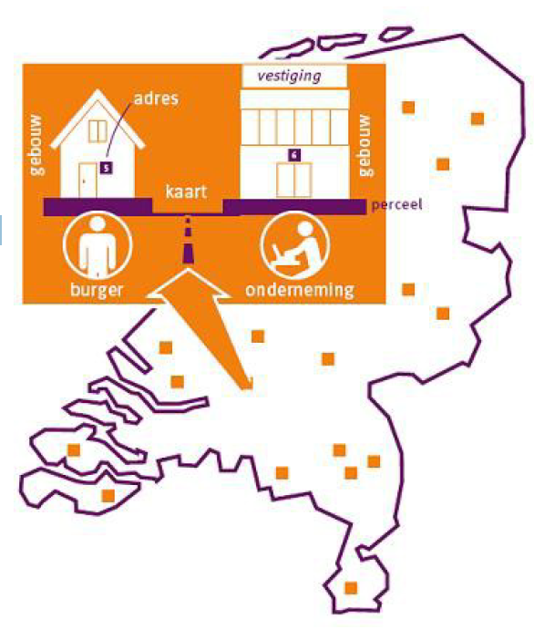
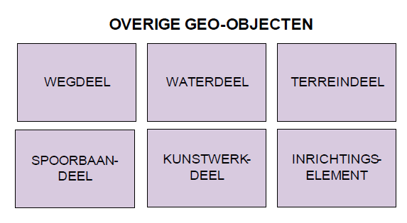
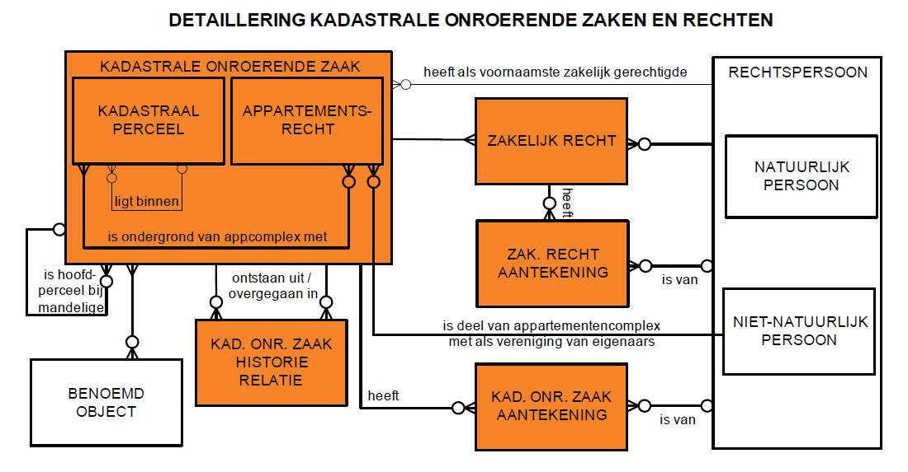
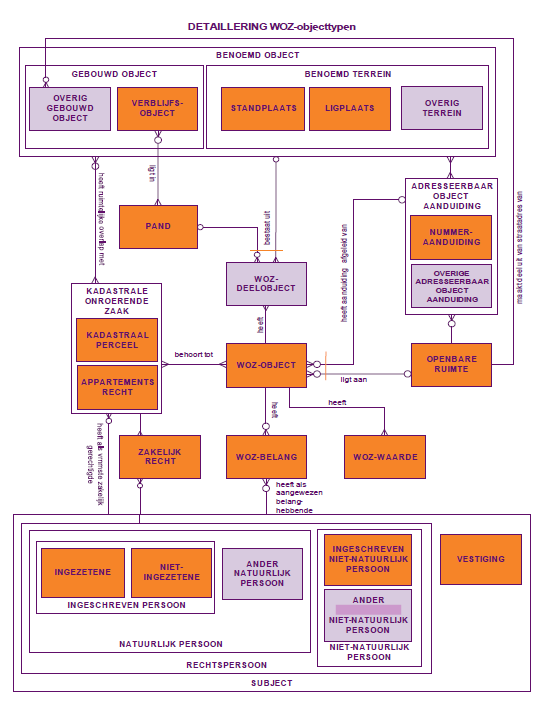
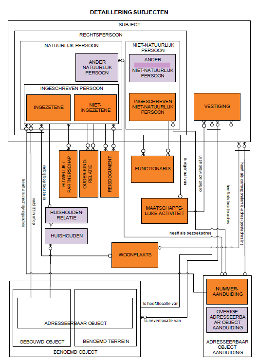
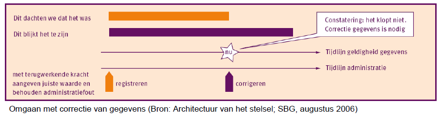

# Objectenmodel

In dit hoofdstuk bakenen we allereerst het stelsel van gemeentelijke basisgegevens af (paragraaf 2.1). We lichten het referentiemodel toe op basis van de objecttypen en hun relaties (paragraaf 2.3). We besteden ook bijzondere aandacht aan de doelen van dit stelsel (paragraaf 2.2) en aan de metagegevens (paragraaf 2.4). Het stelsel schetsen we in de nevenstaande figuur.

## Afbakening

Het stelsel van gemeentelijke basisgegevens is geen basisregistratie zoals bedoeld in het (landelijke) stelsel van basisregistraties. Het is de vertaling van dit stelsel naar de gemeentelijke informatievoorziening. Hierin is nadrukkelijk behoefte aan samenhang tussen de objecten en gegevens uit die basisregistraties èn behoefte aan specifieke gemeentelijke basisgegevens. Het RSGB is dan ook meer dan de optelsom van de landelijke basisregistraties. Dit is hieronder gevisualiseerd. Ook ondersteunt de gemeentelijke informatievoorziening diverse taakgebieden en bestaan er uiteenlopende informatiebehoeften. Voor sommige taakgebieden is, of wordt dit uitgewerkt in specifieke informatiemodellen. Deze zijn gerelateerd aan het stelsel van gemeentelijke basisgegevens doordat zij, waar dat zinvol is, een deel van deze objecten en gegevens bevatten.
Het kan voorkomen dat dergelijke taakspecifieke modellen ook zijn gebaseerd op gegevensuitwisseling met niet-gemeentelijke ketenpartners, die op hun beurt weer andere sectormodellen toepassen. De specificaties daarin zouden kunnen afwijken van die in dit referentiemodel. Om dat te voorkomen, lijkt het wenselijk om objecten en gegevens waarvoor dit geldt en die uitgewisseld worden tussen sectoren, op te nemen (en te specificeren) in het landelijk stelsel van basisregistraties. Door deze (gewijzigde) specificaties over te nemen in het referentiemodel ontstaat er weer harmonie tussen de informatiemodellen op de diverse niveaus en binnen de verschillende sectoren.

## Doelen
De gemeentelijke gegevenshuishouding omvat een diversiteit aan objecten, gegevens daarvan en relaties daartussen. In de praktijk mondt dit uit in een groot aantal eilanden met eigen specificaties die uitwisseling, koppeling, meervoudig en ‘gemeentebreed’ gebruik van gegevens belemmeren. Eenduidigheid is daarom dringend gewenst. De kern hiervan zijn de gemeentelijke basisgegevens. Dit referentiemodel specificeert het objecten- of gegevensmodel van deze basisgegevens. Dat is in 1998 gebeurd in het GFO-Basisgegevens. Het RSGB kunt u beschouwen als een herziening daarvan op basis van hedendaagse inzichten, met name de komst van het landelijk stelsel van basisregistraties.
Het RSGB wil eraan bijdragen dat gemeenten en daarmee samenwerkende organisaties de kern van hun gegevenshuishouding, de basisgegevens, eenmalig onderhouden en meervoudig gebruiken. De achterliggende doelen zijn:
- het eenduidig onderhouden van basisgegevens door gemeenten;
- uitwisseling van basisgegevens mogelijk te maken, door leveranciers hun software daarop te laten baseren; en
- het waarborgen van het uitwisselen met, en het benutten van, het landelijk stelsel van basisregistraties.

**Houvast**
Dit gegevensmodel vormt geen grondslag voor een (relationele) database. Het staat partijen – gemeenten, leveranciers – vrij om een eigen technische realisatievorm te kiezen. Die kan bijvoorbeeld bestaan uit meerdere databases. De essentie van het referentiemodel is vooral om eenduidig aan te geven welke gegevens kunnen worden ontleend aan het Stelsel van Gemeentelijke Basisgegevens: welke informatievragen kunt u stellen die ook kunnen worden beantwoord? Denk bijvoorbeeld aan ruimtelijke relaties tussen objecten. Uit het model kunt u afleiden over welke ruimtelijke relaties u informatie kunt krijgen, ongeacht of deze relaties administratief zijn vastgelegd, of gegenereerd worden met behulp van GIS-analysetechnieken.
Veel informatievragen zullen voortkomen uit softwarecomponenten die bepaalde taken van de gemeente ondersteunen, en aan softwarecomponenten die delen van het stelsel ondersteunen. Om deze componenten te kunnen laten samenwerken, hebben we het referentiemodel uitgewerkt in een nieuwe versie van de berichtenstandaard StUF-BG, waarin we services of berichten definiëren.
Ten slotte biedt het referentiemodel gemeenten houvast als zij zelf databases en software willen ontwikkelen en helpt het hen bij het selecteren van softwarecomponenten en databases van leveranciers. Het is raadzaam om aan – potentiële – leveranciers steeds te vragen of zij hun database baseren op het referentiemodel en of zij de berichten ondersteunen die op basis van het referentiemodel zijn gespecificeerd.

## Toelichting
In deze paragraaf lichten we het objectenmodel toe. Het model op hoofdlijnen is weergegeven in de samenvatting. Het is gebaseerd op de modellen van de diverse basisregistraties. We wijken niet af van deze modellen, maar in sommige gevallen zijn we gedetailleerder of hebben 10
we bepaalde gegevens niet overgenomen. Verder hebben we de modellen aangevuld en met elkaar verbonden, om te kunnen voldoen aan de gemeentelijke behoefte aan basisgegevens. We modelleren alleen de actuele situatie. De behoefte aan historie specificeren we met de desbetreffende metagegevens.

**Tekenwijze**
We brengen een objecttype in beeld met een rechthoek. De naam van het objecttype is in de rechthoek vermeld. In een oranje vlak staan de objecttypen die deel uitmaken van enige (catalogus van een) basisregistratie (A). KING heeft de andere objecttypen toegevoegd. Een witte rechthoek visualiseert een objecttype dat uit meerdere andere objecttypen is samengesteld. Dit is een zogenaamde generalisatie van objecttypen. Laatstgenoemde objecttypen zijn op hun beurt specialisaties van het gegeneraliseerde objecttype. Een gegeneraliseerd objecttype heeft een ‘vet’ kader (C) als één of meer van de specialisaties daarvan deel uitmaken van enige (catalogus van een) basisregistratie. In een blauw vlak staan de objecttypen die geen generalisaties zijn van andere objecttypen en geen deel uitmaken van enige (catalogus van een) basisregistratie (B).

Tussen de objecttypen brengen we de drie soorten relaties als volgt in beeld: een 1:1-relatie (een lijn), een 1:N-relatie (een lijn met één ‘harkje’) en een N:M-relatie (een lijn met twee ‘harkjes’). Een relatie die deel uitmaakt van enige (catalogus van een) basisregistratie is ‘vetter’ gevisualiseerd dan relaties waarvoor dit niet geldt: de relaties die KING heeft toegevoegd. Een relatie veronderstelt dat een object van het ene objecttype altijd gerelateerd is aan dat van het andere objecttype. Wanneer dit niet het geval hoeft te zijn, dan ziet u dat aan het open rondje aan het uiteinde van de relatie(lijn). In het voorbeeld: een object van objecttype B is altijd gerelateerd aan een object van objecttype A, maar andersom hoeft dat niet het geval te zijn. Met een of-of-relatie tenslotte bedoelen we dat een object van – in dit geval – objecttype C een relatie kent met een object van één van beide gerelateerde objecttypen, hier objecttype A of B.

**Basisregistratie-objecten**
De volgende objectenmodellen vormen de kern van het objectenmodel: de Basisregistraties van Adressen en Gebouwen (de BAG: BRA en BGR), de Basisregistratie Personen (GBA en RNI), de Basisregistratie Ondernemingen en Rechtspersonen (het NHR oftewel Nieuw Handelsregister), de Basisregistratie Kadaster (de BRK), de BasisRegistratie WOZ (de BRWOZ) en de Basisregistratie Grootschalige Topografie (GBKN) cq. het Informatiemodel Geografie (IMGeo).
Het gaat om de objecttypen: WOONPLAATS, OPENBARE RUIMTE, NUMMERAANDUIDING (onderdeel van ADRESEERBAAR OBJECT AANDUIDING), VERBLIJFSOBJECT (onderdeel van GEBOUWD OBJECT), STANDPLAATS, LIGPLAATS (beide onderdeel van BENOEMD TERREIN), PAND, INGEZETENE (PERSOON in BRP-termen, hier onderdeel van NATUURLIJK PERSOON), INGESCHREVEN NIET-NATUURLIJK PERSOON (onderdeel van 11
OBJECTTYPE BOBJECTTYPE A1:N-relatieniet altijd voor-komende relatieTekensymboliekobjecttype van basisregistratieobjecttype niet in landelijke basisregistratiealtijd voorko-mende relatieOBJECTTYPE Cgeneralisatie ('groep') van meer objecttypen;1 of meer van laatstgenoemde objecttypen maakt deel uit van een basisregistratieof-of-relatieN:M-relatie
NIET-NATUURLIJK PERSOON), MAATSCHAPPELIJKE ACTIVITEIT, VESTIGING, KADASTRALE ONROERENDE ZAAK, ZAKELIJK RECHT, WOZ-OBJECT, WOZ-BELANG, WOZ-WAARDE en de geo-objecttypen: WEGDEEL, WATERDEEL, TERREINDEEL, SPOORBAANDEEL, KUNSTWERKDEEL en INRICHTINGSELEMENT.

**Adressen, gebouwen en terreinen**
KING heeft de GEMEENTE als objecttype toegevoegd, omdat zij het bestuurlijke gebied is waarbinnen de betreffende ruimtelijke objecten liggen.
Binnen een gemeente bevinden zich één of meer WOONPLAATSen, maar een woonplaats bevindt zich altijd binnen één gemeente.
Binnen elke woonplaats bevinden zich één of meer OPENBARE RUIMTEn die in de BAG zijn gedefinieerd. Aangezien een openbare ruimte, zoals een straat, zich kan uitstrekken over meerdere woonplaatsen is GEMEENTELIJKE OPENBARE RUIMTE toegevoegd. De OPENBARE RUIMTE is nu dát deel van de gemeentelijke openbare ruimte dat zich binnen één woonplaats bevindt.
De CBS-indeling in WIJKen en BUURTen hebben we eveneens toegevoegd. De geometrie is één van de te registreren gegevens. Een belangrijk voordeel hiervan is dat managementinformatie geografisch in beeld gebracht kan worden.
Aan een OPENBARE RUIMTE kunnen ADRESSEERBARE OBJECT AANDUIDINGen gerelateerd zijn. In de meeste gevallen gaat het om NUMMERAANDUIDINGen die de BAG onderscheidt. Soms is het noodzakelijk om ook andere adressen vast te stellen, bijvoorbeeld van terreinen die geen stand- en ligplaatsen zijn en eventueel van gebouwen die geen
verblijfsobjecten zijn. Een dergelijke OVERIGE ADRESSEERBAAR OBJECT AANDUIDING wordt weliswaar officieel vastgesteld, maar maakt geen deel uit van de BAG.
De BGR onderscheidt gebouwde objecten als VERBLIJFSOBJECTen en terreinen als STAND- en LIGPLAATSen. In het RSGB hebben we voor het onderscheid in gebouwen (GEBOUWD OBJECT) en terreinen (BENOEMD TERREIN) gekozen. Met de verblijfsobjecten wordt immers niet de hele gebouwde omgeving, voor zover zinvol, gemodelleerd. Vandaar dat we het OVERIG GEBOUWD OBJECT hebben toegevoegd. Dit geeft, in combinatie met de verblijfsobjecten, gemeenten de mogelijkheid om het deel van de gebouwde omgeving dat zij relevant vinden adequaat te registreren. Een OVERIG GEBOUWD OBJECT kan op één van drie manieren een adres krijgen:
- door gebruik te maken van een ‘BAG-adres’ (NUMMERAANDUIDING), aangevuld met een locatieomschrijving;
- door een officieel adres vast te stellen dat niet in de BAG wordt geregistreerd (OVERIGE ADRESSEERBAAR OBJECTAANDUIDING);
- door de ligging ten opzichte van een OPENBARE RUIMTE aan te geven met een locatieomschrijving.
Gemeenten hebben de behoefte om naast stand- en ligplaatsen ook andere afgebakende terreinen te registreren en een officieel (niet-authentiek) adres te geven. Hiervoor hebben we het OVERIG TERREIN toegevoegd. In combinatie met de stand- en ligplaatsen kunnen gemeenten dan alle terreinen registreren waaraan zij een officieel adres willen toekennen.
VERBLIJFSOBJECT, STANDPLAATS en LIGPLAATS hebben we gegeneraliseerd naar ADRESSEERBAAR OBJECT teneinde aan te sluiten bij de terminologie van de BAG. GEBOUWD OBJECT en BENOEMD TERREIN hebben we gegeneraliseerd naar BENOEMD OBJECT omdat veel relaties de groepering van al deze objecttypen betreffen.
VERBLIJFSOBJECTen maken deel uit van PANDen (gevisualiseerd met de ligt-in-relatie). Maar niet elk pand bevat verblijfsobjecten. Voor dergelijke panden hebben we een optionele relatie toegevoegd tussen PAND en BUURT om van de panden die niet aan VERBLIJFSOBJECTen worden gerelateerd, duidelijk te maken binnen welke buurt (en daarmee gemeente) zij vallen, bijvoorbeeld omdat een gemeente eigenaren van dergelijke panden wil aanschrijven. Overigens valt de relatie tussen een pand als bijgebouw van een verblijfsobject zijnde een hoofdgebouw af te leiden via de relaties van beide objecten met het WOZ-object.

**Topografie**
Een deel van de geschetste objecttypen heeft betrekking op fysieke ruimtelijke objecten of geo-objecten zoals VERBLIJFSOBJECT en PAND. De andere geo-objecten benoemen we hier onafhankelijk van elkaar, zoals hiernaast is geschetst.

Het RSGB bevat objecttypen uit BAG, BRP, NHR, BRK, WOZ en IMGeo. Gemeenten voegen aanvullende objecttypen toe voor hun eigen processen.

**Kadaster**
Het objectenmodel van het stelsel van basisregistraties kent een n:m-relatie tussen enerzijds onroerende zaken (onderdeel van de BasisRegistratie Kadaster) en anderzijds verblijfsobjecten en stand- en ligplaatsen. Een onroerende zaak is de groepering van kadastrale percelen, appartementsrechten en leidingnetwerk. Alleen de eerste twee zijn zodanig belangrijk voor de gemeentelijke informatievoorziening dat die in het referentiemodel zijn opgenomen. Het KADASTRAAL PERCEEL en het APPARTEMENTSRECHT vormen gezamenlijk de KADASTRALE ONROERENDE ZAAK. Om aan te sluiten bij de toegevoegde objecttypen (OVERIG GEBOUWD OBJECT en OVERIG TERREIN) hebben we de relatie met adresseerbare objecten vormgegeven als een verplichte relatie tussen BENOEMD OBJECT en KADASTRALE ONROERENDE ZAAK.
Verder hebben we een 1:n-relatie toegevoegd tussen kadastrale percelen onderling (‘ligt binnen’). Een geheel perceel beschikt over geometrie (de perceelgrens), voor deelpercelen is dit niet het geval. Door deze relatie is van deelpercelen vast te leggen bij welke gehele percelen zij qua ligging horen. Op analoge wijze hebben we van de BRK afgeleid de ‘liggings-relaties’ tussen appartementsrechten en kadastrale percelen (‘is ondergrond van …’) via de zgn. appartementscomplexen. Op deze wijze is van elke kadastrale onroerende zaak vast te leggen om welk deel van het gemeentelijk grondgebied het gaat. Tot slot hebben we de voornaamste zakelijk gerechtigde (een RECHTSPERSOON) van een KADASTRALE ONROERENDE ZAAK toegevoegd.
Het ZAKELIJK RECHT legt van elke kadastrale onroerende zaak vast welke RECHTSPERSOON (of RECHTSPERSOONen) daarop zakelijke rechten uitoefent.

**De WOZ**
Centraal in dit gedeelte van het obejctenmodel staat het WOZ-OBJECT zoals dat in de BRWOZ voorkomt. Dit heeft relaties naar de KADASTRALE ONROERENDE ZAAKen (percelen en appartementsrechten) die tot het WOZ-object behoren, naar de zgn. WOZ-BELANGen, naar de WOZ-WAARDEn en naar de WOZ-DEELOBJECTen waaruit het is samengesteld.
Het WOZ-DEELOBJECT betreft een element van een WOZ-OBJECT; meerdere WOZ-deelobjecten (bijvoorbeeld de woning, de losstaande schuur en de grond) vormen gezamenlijk een WOZ-object en/of onderbouwen de waarde ervan nader (bijvoorbeeld de waarde-invloed van bodemverontreiniging). Voor een WOZ-deelobject geldt telkens één van de volgende situaties:
het komt overeen met een benoemd object (gebouwd object, benoemd terrein) of is een gedeelte daarvan,
het komt overeen met een pand of is een gedeelte daarvan of
het is geen van beide, het WOZ-deelobject betreft geen gebouwd object, pand, benoemd terrein of gedeelte daarvan; een voorbeeld hiervan is een bouwkavel waarop nog geen bouwvergunning verleend is.
Het is bovendien zo dat een WOZ-deelobject nooit overeen kan komen met meer dan één (deel van een) benoemd object of pand. En, indien een WOZ-deelobject een relatie heeft met een pand, dan kan het alleen gaan om panden waarbinnen geen verblijfsobjecten afgebakend zijn, zoals garages en schuren bij woningen, en gedeelten van panden die niet afgebakend zijn als verblijfsobject, zoals een niet-afsluitbare parkeergarage onder een appartementencomplex.
Door middel van het objecttype WOZ-BELANG leggen we vast welk subject als belanghebbende eigenaar is aangewezen, welk subject als belanghebbende gebruiker is aangewezen en eventueel welke "derden" zich bekend maken als "medebelanghebbenden".
WOZ-objecten moeten voorzien kunnen worden van een voor de belanghebbende begrijpelijke aanduiding van de locatie waar het WOZ-object zich bevindt: de WOZ-object-aanduiding. In het gangbare spraakgebruik gaat het om een begrijpelijk adres voor het WOZ-object. Uitgangspunt van het RSGB is dat we voor de aanduiding van het WOZ-object gebruik maken van de adressen van de benoemde objecten waaraan het WOZ-object via zijn WOZ-deelobjecten is gerelateerd. Veelal is de WOZ-aanduiding eenduidig af te leiden uit deze relaties. Om ook in andere gevallen een WOZ-object van de aanduiding te kunnen voorzien, hebben we relatiesoorten toegevoegd van WOZ-OBJECT naar ADRESSEERBAAR OBJECT AANDUIDING en naar OPENBARE RUIMTE.

**Subjecten**
Het SUBJECT is de verzameling van RECHTSPERSOONen: NATUURLIJKe PERSOONen en NIET-NATUURLIJKe PERSOONen, en VESTIGINGen. Deze benamingen wijken af van de door SBG gehanteerde terminologie. Dit doen we om verwarring tussen de begrippen persoon en natuurlijke persoon in het spraakgebruik te voorkomen.
Natuurlijk persoon
Een NATUURLIJK PERSOON kan een INGESCHREVEN PERSOON zijn, of een ANDER NATUURLIJK PERSOON. En een ingeschreven persoon kan op zijn beurt weer een INGEZETENE of een NIET-INGEZETENE zijn. Een INGEZETENE is de persoon zoals de GBA die benoemd (als onderdeel van de BasisRegistratie Personen). De twee andere typen natuurlijke personen hebben we toegevoegd, omdat
ook deze personen van belang zijn voor het uitoefenen van de gemeentelijke taken. Met de niet-ingezetenen lopen we vooruit op de invoering van de Registratie Niet-Ingezetenen als onderdeel van de BasisRegistratie Personen. De combinatie met de ingezetenen omvat daarmee alle personen die woonachtig zijn in Nederland, of die in het buitenland wonen, maar zijn ingeschreven als (niet-)ingezetene. Alle andere personen die relevant zijn voor de gemeentelijke taakuitoefening wonen in het buitenland en hebben we als ANDER BUITENLANDS NATUURLIJK PERSOON gemodelleerd. We onderscheiden twee groepen relaties tussen ingeschreven personen: OUDER-KIND-RELATIE en HUWELIJK/GEREGISTREERDPARTNERSCHAP-RELATIE.
Een INGESCHREVEN PERSOON verblijft gewoonlijk in of op een ADRESSEERBAAR OBJECT (VERBLIJFSOBJECT, STAND- of LIGPLAATS). Is de verblijfsrelatie onbekend dan wordt de verblijfplaats, indien mogelijk, omschreven door een combinatie van de WOONPLAATS waarin de ingeschrevene verblijft met een zogenaamde nadere adresaanduiding. Is dit niet mogelijk dan resteert het registreren van een correspondentieadres of van een buitenlands adres, als de ingeschrevene in het buitenland verblijft. Aangezien een natuurlijk persoon zich kan inschrijven op een nevenadres wordt zijn of haar inschrijvingsadres bepaald door de relatie naar NUMMERAANDUIDING.
Het correspondentieadres hebben we toegevoegd aan NATUURLIJK PERSOON. Dit kan zijn een (relatie met een) OVERIGE ADRESSEERBAAR OBJECTAANDUIDING (een NUMMERAANDUIDING of ander officieel adres) of een postadres (postbus of antwoordnummer) dat zich in een WOONPLAATS bevindt.
Zowel correspondentie-adres als buitenlands adres gelden dus ook voor de ANDER BUITENLANDS NATUURLIJK PERSOON.
Eén of meer ingeschreven personen kunnen gezamenlijk een HUISHOUDEN vormen dat is gehuisvest in of op een ADRESSEERBAAR OBJECT. Daarin respectievelijk daarop kunnen zich meerdere HUISHOUDENs bevinden.

Ondernemingen en rechtspersonen
Voor ondernemingen en rechtspersonen gaan we uit van het model van het NHR. Hierin worden binnen- en buitenlandse NIET-NATUURLIJKE PERSOONen geregistreerd die staan ingeschreven bij de Kamer van koophandel: de INGESCHREVEN NIET-NATUURLIJK PERSOON. Daaraan hebben we toegevoegd de ANDER NIET NATUURLIJK PERSOON. Dit zijn buitenlandse niet-natuurlijke personen die niet zijn ingeschreven bij de Kamer van Koophandel, en om die reden geen deel uitmaken van het NHR, maar die wel relevant zijn voor de gemeente.
De FUNCTIONARIS-relatie geeft aan welke rechtspersonen namens de niet-natuurlijke persoon rechtshandelingen kunnen verrichten. Een functionaris kan dus zowel een natuurlijk als een niet-natuurlijk persoon zijn.
Elke RECHTSPERSOON kan eigenaar zijn van één MAATSCHAPPELIJKE ACTIVITEIT, die hij uitoefent in één of meer VESTIGINGen. Gezien de eigenschappen van een VESTIGING beschouwen we dit objecttype in het RSGB als één van de subtypen van SUBJECT.
Het NHR kent per VESTIGING slechts één VERBLIJFSOBJECT als locatie voor de activiteiten van die VESTIGING. Voor de gemeente kan het relevant zijn te weten in welke andere gebouwde objecten en/of benoemde terreinen de vestiging haar activiteiten verder uitoefent. Daarom hebben we een relatie ten behoeve van nevenlocaties toegevoegd. Daarnaast hebben we beide vestigingslocatierelaties, voor hoofd- en nevenlocaties, uitgebreid tot alle benoemde objecten (dus ook het OVERIG GEBOUWD OBJECT,STANDPLAATS, LIGPLAATS en OVERIG TERREIN). Dit is een aanvulling op het NHR. Aangezien een vestiging zich kan inschrijven op een nevenadres wordt het vestigingsadres bepaald door de relatie naar ADRESSEERBAAR OBJECT AANDUIDING.
Evenals bij NATUURLIJK PERSOON hebben we het correspondentieadres toegevoegd aan de NIET-NATUURLIJK PERSOON en aan de VESTIGING. Dit kan een NUMMERAANDUIDING of OVERIGE ADRESSEERBAAR OBJECTAANDUIDING zijn, of een postadres. NIET-NATUURLIJK PERSOON en VESTIGING kennen tevens een buitenlands adres. Aangezien ook een NATUURLIJK PERSOON een correspondentie-adres en een buitenlands adres kent, hebben we deze gegevens gemodelleerd als kenmerken van SUBJECT.

## Opbouw
Het gegevensmodel is opgebouwd uit objecttypen, attribuut- en relatiesoorten. In deze paragraaf gaan we in op een aantal aspecten hiervan.

### Metagegevens
Objecttypen, attribuut- en relatiesoorten specificeren we door middel van metagegevens. Zij zijn van essentieel belang zijn voor de werking van het landelijk stelsel van basisregistraties en dus voor het RSGB. Als bijvoorbeeld niet bekend is of een bepaald gegeven nog wel geldig is, dan is de kwaliteit van het functioneren van de overheid in het geding.
De algemene definitie van metagegeven is: een gegeven over een gegeven of over een aggregatie van gegevens.
Enerzijds gaat het om de betekenis van een gegeven zoals naam, definitie en domein, en anderzijds om de wijze waarop de waarde van een gegeven is bepaald (het proces) en wat uit die waarde afgeleid mag worden. Een voorbeeld van het laatste is het metagegeven ‘Status = 19
“in onderzoek”’ bij het gegeven “CORNELIS STEENMANS woont op het adres HONDSDRAFLAAN 30 te EINDHOVEN”. De gebruiker weet nu dat het woonadres van Cornelis Steenmans wellicht niet juist is en dat het wordt onderzocht.
Het is raadzaam eenduidig om te gaan met metagegevens. In deel II definiëren we deze gegevens waarvan we in de volgende tabel een overzicht geven.

| Objecttype                    | Attribuutsoort                     | Relatiesoort                       |
|:------------------------------|:----------------------------------:|-----------------------------------:|
| Naam objecttype               | Naam attribuutsoort                | Naam relatiesoort                  | 
| Mnemonic objecttype           | Herkomst attribuutsoort            | Herkomst relatiesoort              |
| Herkomst objecttype           | Code attribuutsoort                | Code relatiesoort                  |
| Definitie objecttype          | XML-tag attribuutsoort             |                                    |  
| Herkomst definitie objecttype | Definitie attribuutsoort           | Definitie relatiesoort             |
| Datum opname objecttype       | Herkomst definitie attribuutsoort  | Herkomst definitie relatiesoort    |
| Toelichting objecttype        | Datum opname attribuutsoort        | Datum opname relatiesoort          |
| Unieke aanduiding objecttype  | Toelichting attribuutsoort         | Toelichting relatiesoort           |
| Populatie objecttype          | Domein attribuutsoort              |                                    |
| Kwaliteitsbegrip objecttype   | Indicatie materiële historie       | Indicatie materiële historie       |
| Overzicht attributen          | Indicatie formele historie         | Indicatie formele historie         |
| Overzicht relaties            | Aanduiding gebeurtenis             | Aanduiding gebeurtenis             |
|                               | Aanduiding brondocument            | Aanduiding brondocument            |
|                               | Indicatie in onderzoek             | Indicatie in onderzoek             |
|                               | Aanduiding strijdigheid/nietigheid | Aanduiding strijdigheid/nietigheid |
|                               | Indicatie kardinaliteit            | Indicatie kardinaliteit            |
|                               | Indicatie authentiek               | Indicatie authentiek               |
|                               | Regels attribuutsoort              | Regels relatiesoort                |

Overzicht metagegevens

### Historie
Het aspect tijd speelt een belangrijke rol in het gebruik van de informatie uit (basis)registraties. Afnemers hebben eigen rechtsprocedures en moeten kunnen herleiden wanneer attribuutwaarden als bekend mochten worden verondersteld. Als bijvoorbeeld besluiten ter discussie worden gesteld, is het juridisch van belang te achterhalen op basis van welke attribuutwaarden zo’n besluit genomen is. Als onjuiste attribuutwaarden zijn gebruikt, is het relevant te weten of de juiste attribuutwaarden tijdens de besluitvorming al bekend waren.

**Tijdslijnen**
Er spelen twee tijdslijnen een rol bij het herleiden van attribuutwaarden:
- Wanneer is iets gebeurd, in de werkelijkheid of volgens opgave (wanneer zijn de opgenomen gegevens geldig)? Dit valt binnen de tijdlijn van de aangehouden werkelijkheid.
- Vanaf wanneer wist de overheid (als collectief van organisaties) dat de gegevens bekend waren? Dit valt binnen de tijdlijn van het administratieproces of de administratieve werkelijkheid.
In de rapportage 'Architectuur van het stelsel' (Stroomlijning BasisGegevens, 2006) wordt geadviseerd om beide tijdslijnen te registreren, om de attribuutwaarden van een bepaald moment te kunnen reconstrueren. Dit advies hebben we overgenomen. In de diverse basisregistraties wordt hieraan op verschillende wijzen invulling gegeven. Wij hebben er voor gekozen om in deze tijdslijnen op eenduidige wijze te voorzien met de attribuutsoorten ‘datum begin geldigheid object’ en ‘datum einde geldigheid object’ en het metagegeven ‘indicatie materiële historie’ respectievelijk het metagegeven ‘indicatie formele historie’. In sommige gevallen hebben we de beide attribuutsoorten onder specifieke namen opgenomen, zoals de geboortedatum en de overlijdensdatum van een natuurlijk persoon. De metagegevens specificeren we als volgt:
- Indicatie materiële historie: indicatie of de materiële historie van de attribuutsoort te bevragen is. Materiële historie geeft aan wanneer een verandering is opgetreden in de werkelijkheid die heeft geleid tot verandering van de attribuutwaarde. Materiële historie impliceert dat actuele, historische en eventuele toekomstige attribuutwaarden te bevragen zijn
- Indicatie formele historie: indicatie of de formele historie van de attribuutsoort te bevragen is. Formele historie geeft aan wanneer in de administratie een verandering is verwerkt van de attribuutwaarde (wanneer was de verandering bekend en is deze verwerkt).

**Periode van geldigheid**
De materiële historie heeft betrekking op een individuele attribuutsoort of de groep van attribuutsoorten die tegelijkertijd, als gevolg van een gebeurtenis, wijzigen (bijvoorbeeld de woonadresgegevens van een natuurlijk persoon als gevolg van een verhuizing). Ofschoon het mogelijk lijkt om de periode tussen het ontstaan en het beëindigen van een object af te leiden uit de reeks aan perioden van de materiële historie van de attribuutsoorten van dat object, hebben we er in het referentiemodel voor gekozen om beide op te nemen. Zo wordt het ontstaan en het beëindigen van een object expliciet opvraagbaar. En in sommige gevallen worden attribuutwaarden van een object al geregistreerd voordat het object feitelijk bestaat. Bijvoorbeeld in de BAG de gegevens van de nieuwbouwvergunning bij het pand dat waarschijnlijk gebouwd gaat worden.
De periode die gemarkeerd wordt door de ‘datum begin geldigheid object’ en de ‘datum einde geldigheid object’ geeft aldus de periode aan waarin het object in de werkelijkheid heeft bestaan met de kenmerken die noodzakelijk zijn om van het in de werkelijkheid bestaan te kunnen spreken. Een persoon bestaat bijvoorbeeld pas in de werkelijkheid als deze als baby het lichaam van de moeder heeft verlaten. De materiële historie markeert de periode waarin de waarde(n) van één of meer attribuutsoorten van het object geldig zijn of waren.
Waar mogelijk en verantwoord hebben we de materiële (en ook de formele) historie opgenomen voor de groep van alle attribuutsoorten van een objectsoort. Bij veel objecttypen is dit niet mogelijk omdat we de (materiële) historie van de landelijke basisgegevens willen onderscheiden van de historie van de gemeentelijke basisgegevens. Zo gaat de afstemming niet verloren met de landelijke basisregistratie over deze basisgegevens. Ook komt het voor dat een basisregistratie zelf al groepen van attribuutsoorten met eigen historiekenmerken 21
onderscheid. Dit is het geval in de BRP (GBA) voor bijvoorbeeld de groep (daar ‘categorie’ genaamd) ‘verblijfplaats’.

**Oude gegevens corrigeren**
Een bijzonder geval van historie is het aanbrengen van correcties op attribuutwaarden uit het verleden. Dit gaat zowel om de administratieve werkelijkheid (‘wanneer hadden we wat kunnen weten?’) als de feitelijke cq. aangenomen werkelijkheid (‘wat dachten we dat de feitelijke waarde was op een bepaald moment en wat weten we daar nu over?’). Besluiten en daarop gebaseerde acties worden genomen op basis van de op een bepaald moment bekende (vermeende) werkelijkheid. Het is dus van belang om later te kunnen achterhalen wat die (vermeende) werkelijkheid was, en wat op een later moment de werkelijkheid bleek te zijn. Met de eerder genoemde historie-kenmerken is het mogelijk om correcties op deze wijze te registreren (zie onderstaande figuur).

**Materiële en/of formele historie-indicatie?**
Niet bij elke attribuutsoort (of groep van attribuutsoorten) hebben we beide metagegevens opgenomen. Soms zelfs geen van beide. Voor landelijke basisgegevens hebben we de specificaties in de desbetreffende catalogi gevolgd. Voor gemeentelijke basisgegevens hebben we grofweg de volgende regels gehanteerd:
- in de situatie zoals hiervoor beschreven, waarin historische (en eventueel toekomstige) gegevenswaarden gecorrigeerd moeten kunnen worden en er ook voor de gecorrigeerde waarde inzicht is vanaf wanneer deze geldig is, zijn beide indicaties van toepassing;
- indien er behoefte is aan inzicht in alle waarden (naast de huidige waarde ook historische en eventueel toekomstige waarden) van een attribuutsoort en tevens aan eenduidigheid over de datum vanaf wanneer een wijziging van de attribuutwaarde bekend was, dan zijn eveneens beide indicaties van toepassing; deze situatie impliceert dat correcties aangebracht kunnen worden oftewel houdt de eerstgenoemde situatie in zich.
- indien alleen de huidige waarde (in de werkelijkheid) relevant is en het niet relevant is vanaf wanneer deze waarde geldig is, dan zijn geen van beide indicaties van toepassing;
- indien het relevant is en redelijkerwijs een aanname gedaan kan worden vanaf wanneer een (huidige, historische of eventueel toekomstige) waarde geldig is maar het niet relevant is te weten wanneer die waarde bekend was, dan is alleen de indicatie materiële historie van toepassing; er is in deze situatie dus geen inzicht of een waarde wellicht gecorrigeerd is;
- indien redelijkerwijs zelden of nooit een aanname gedaan kan worden wanneer zich de wijziging in de werkelijkheid voordeed op basis waarvan de waarde gewijzigd is maar het wel relevant zou zijn vanaf wanneer de waarde-wijziging bekend was, dan zou alleen de indicatie formele historie van toepassing zijn. Evenwel, bij het eventueel doorvoeren van correcties in de historie ontstaat desinformatie (stel: vandaag is bekend geworden dat de waarde over een periode ergens in 2002/2003 anders was; formele historie-datum is dan vandaag terwijl de huidige waarde een andere is dan de waarde in genoemde periode). Aangezien het opnemen van historie veronderstelt dat die gecorrigeerd kan worden, hebben we deze combinatie van historie-indicaties niet opgenomen voor die situaties. Een andere situatie doet zich voor als de eenmaal vastgestelde waarde nooit wijzigt en tevens niet gecorrigeerd kan of mag worden, Indien het voor een dergelijk attribuutsoort niet relevant is wanneer de waarde in de werkelijkheid is ontstaan en de waarde niet gelijktijdig ontstaat bij het ontstaan van het object, dan hebben we geen materiële maar wel formele historie opgenomen, mits het laatste relevant is. Een voorbeeld hiervan is … Een derde situatie doet zich voor als de attribuutsoort een datum is, bijvoorbeeld de overlijdensdatum van een persoon. De waarde van de attribuutsoort is tevens de datum van de materiële historie. Als hierop correcties plaats kunnen vinden, dan hebben we eveneens geen materiële maar wel formele historie opgenomen.
Deze regels geven inzicht in de wijze waarop de combinaties van beide historie-indicaties bij een attribuut- of relatiesoort geïnterpreteerd moeten worden.

### Afleidbare gegevens
Het RSGB bevat onder andere zogenaamde afgeleide gegevens: gegevens die afleidbaar zijn uit andere attribuut- en/of relatiesoorten. Dit lijkt op redundantie. Toch hebben we deze gegevens daar opgenomen waar er ten eerste vraag is naar het afgeleide gegeven en ten tweede het gegeven niet eenvoudig af te leiden is (er moet sprake zijn van enige mate van complexiteit). Wel hebben we het aantal afgeleide gegevens zo beperkt mogelijk gehouden.
Een voorbeeld is de 'Datum vestiging in Nederland' van een Ingeschreven persoon. De afleiding van dit gegeven is niet triviaal. Door het als afleidbaar gegeven op te nemen kan het opgevraagd worden zonder dat de historie of andere gegevens van het object opgevraagd hoeven te worden om daaruit dit gegeven af te leiden.

### Domeinwaarden of tabel
In bijvoorbeeld het GFO Basisgegevens werd veel gewerkt met codetabellen om de mogelijke waarden van een attribuutsoort te specificeren. In bepaalde catalogi van basisregistraties, zoals die van de BAG, is hiervan geheel afgezien. De mogelijke waarden van een attribuutsoort zijn daarin als domeinwaarden van de attribuutsoort gespecificeerd. In het RSGB hebben we bij het laatste zoveel mogelijk aangesloten. Alleen als sprake is van dynamiek in de domeinwaarden hebben we een 'tabel-objecttype' opgenomen. Dit betreft de situaties waarin domeinwaarden kunnen veranderen en/of het aantal domeinwaarden kan toe- of afnemen. Een voorbeeld is het objecttype LAND.
