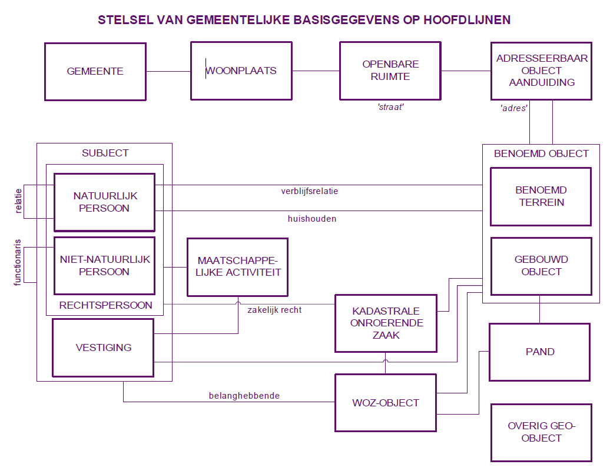

# Samenvattng

De invoering van een overheidsbreed stelsel van basisregistraties is één van de meest ingrijpende ontwikkelingen waarmee gemeenten te maken hebben. Het Referentiemodel Stelsel van Gemeentelijke Basisgegevens (RSGB) biedt gemeenten en hun leveranciers houvast bij het invoeren en het gebruiken van deze gegevens.
Dit objectenmodel voor de gemeentelijke basisgegevens presenteert de samenhang tussen basisregistraties op een logische wijze. Maar gemeenten hebben meer gegevens nodig voor hun werkprocessen dan nu in de landelijke basisregistraties beschikbaar zijn. Het binnengemeentelijk stelsel is dan ook ‘rijker’ dan het landelijke stelsel.
Dit referentiemodel is onderdeel van de GEMmeentelijke Model Architectuur (GEMMA) van KING. De inhoud is in lijn met de Nederlandse OverheidsReferentieArchitectuur (NORA).

## Inhoud
We hebben het RSGB gebaseerd op de Basisregistraties Adressen (BRA), Gebouwen (BGR), Personen (GBA), Bedrijven (NHR), Kadaster (BRK) en WOZ (BRWOZ) en op de grootschalige topografie die in het Informatiemodel Geografie (IMGeo) is gedefinieerd. We hebben dit aangevuld met gegevens van de voorloper van het referentiemodel, het GFO BasisGegevens uit 1998, waarbij het model bewust beperkt gehouden is.
Het referentiemodel is opgebouwd uit:
- objecttypen zoals ‘Verblijfsobject’ en ‘Ingeschreven persoon’;
- attribuutsoorten die eigenschappen van deze objecttypen beschrijven zoals ‘Bruto inhoud’ en ‘Voornamen’;
- relatiesoorten tussen deze objecttypen zoals ‘Ingeschreven persoon verblijft in Verblijfsobject’. 

## Doelen
Het referentiemodel draagt er aan bij dat gemeenten en daarmee samenwerkende organisaties in staat zijn om de kern van hun gegevenshuishouding, de basisgegevens, in samenhang eenmalig te onderhouden en meervoudig te gebruiken bij de uitoefening van hun taken. Het stroomlijnen van de processen voor het beheer van deze gegevens biedt kansen voor efficiencyverbetering. Meervoudig gebruik van gegevens, waarbij vertrouwd kan worden op de kwaliteit van deze gegevens, is bijvoorbeeld van groot belang voor een goede dienstverlening. Verder vormt het referentiemodel de grondslag voor de berichtenstandaard StUF-B(asis)G(egevens). Leveranciers baseren hun software op deze standaard, zodat uitwisselbaarheid van basisgegevens wordt bereikt. Tot slot waarborgt het referentiemodel de uitwisseling van basisgegevens met het landelijk stelsel van basisregistraties en het benutten van dit stelsel in de gemeentelijke informatievoorziening.

## Invoering
Het is de bedoeling om het referentiemodel in de periode 2009 – 2010 geleidelijk in te voeren. KING verwacht dat leveranciers in die tijd hun software aanpassen aan de basisregistraties. Gedurende de genoemde periode zullen de versies van de berichtenstandaard StUF-BG op basis van het GFO-Basisgegevens en op basis van het RSGB naast elkaar bestaan, zodat een geleidelijke overgang mogelijk is. KING raadt gemeenten nadrukkelijk aan om de ontwikkeling van hun informatievoorziening te baseren op dit referentiemodel en niet alleen uit te gaan van één of meer (catalogi van) landelijke basisregistraties. Op deze manier kunnen gemeenten aansluiten bij het landelijk stelsel én wordt hun eigen informatievoorziening optimaal bediend. Het RSGB vult namelijk de gegevens uit het landelijke stelsel aan met gegevens die voor de gemeentelijke processen cruciaal zijn, maar niet in het landelijk stelsel worden geregistreerd.
